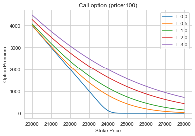
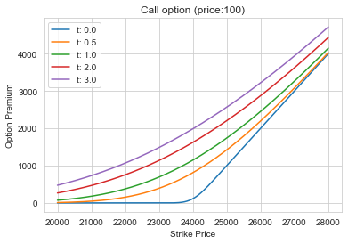

```python
# Import
from catslab.finance.black_scholes_equation import BlackScholesEquation as BS
import numpy as np
from scipy import stats
import matplotlib.pyplot as plt
import seaborn
seaborn.set_style("whitegrid")
```


```python
# Params
S0=24000
sigma=0.12
r=0.0
q=0.0
T=0.5
K=23000
```


```python
# Call option graph
x = np.arange(20000,28000)
plt.figure()
for t in [0.01,0.5, 1,2,3]:
    bs = lambda x: BS.call(S0, sigma ,r, q, t, x)
    plt.plot(x, np.vectorize(bs)(x), label="t: %1.1f"%t)
plt.xlabel("Strike Price")
plt.ylabel("Option Premium")
plt.title("Call option (price:100)")
plt.legend()
```


    <matplotlib.legend.Legend at 0x11a612a58>





```python
# Put option graph
x = np.arange(20000,28000)
plt.figure()
for t in [0.01,0.5, 1,2,3]:
    bs = lambda x: BS.put(S0, sigma ,r, q, t, x)
    plt.plot(x, np.vectorize(bs)(x), label="t: %1.1f"%t)
plt.xlabel("Strike Price")
plt.ylabel("Option Premium")
plt.title("Call option (price:100)")
plt.legend()
```


    <matplotlib.legend.Legend at 0x11aac01d0>





```python
# Parity check
BS.put_call_parity(S0, sigma ,r, q, T, K)
```


    0.0


```python
# IV
C_M=23500

iv_call = BS.iv_call(S0 ,r, q, T, K, C_M)
iv_put = BS.iv_put(S0 ,r, q, T, K, C_M)
print(f"iv_call: {iv_call}, iv_put:{iv_put}")

# Check IV
print(f"call: {BS.call(S0, iv_call ,r, q, T, K)}, put: {BS.put(S0, iv_put ,r, q, T, K)}")
```

    iv_call: 6.513702593093965, iv_put:23.938283060132722
    call: 23500.000000000004, put: 23000.0

